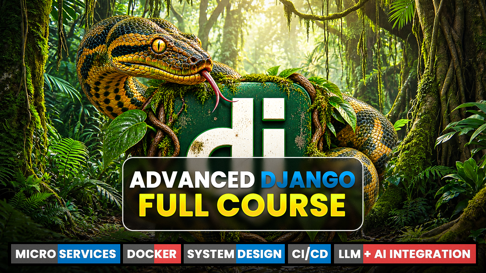
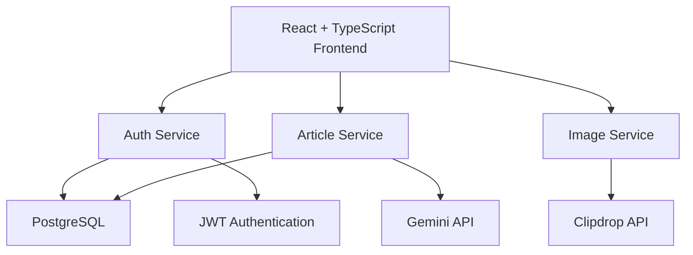

<div align="center">



<br>

# Advanced Django Full Course 2026

<p><b>A complete Django course focused on real-world projects, REST APIs, React/Next.js integration, PostgreSQL, Docker, Microservices, System Design, CI/CD and LLM + AI integration.</b></p>

<p>
Django · REST APIs · React · Next.js · PostgreSQL · Docker · Microservices · System Design · CI/CD · AI
</p>

<br>


<br><br>

<table align="center" width="85%">
<tr>
<td align="center">

<h2>Advanced Django Full Course</h2>

<p>
Learn Django by building real-world projects and understanding<br>
how modern backend applications are designed, developed and deployed.
</p>

</td>
</tr>
</table>

<br>

<sub><em>This repository contains the source code and resources for the Advanced Django Full Course 2026 by AiCodingHub.</em></sub>

</div>

---

## 📑 Table of Contents

<table width="100%">
<tr>

<td valign="top">

1. <a href="#1-overview">Overview</a><br>
2. <a href="#2-what-youll-learn">What You'll Learn</a><br>
3. <a href="#3-course-projects">Course Projects</a><br>
4. <a href="#4-architecture">Architecture</a><br>
5. <a href="#5-technology-stack">Technology Stack</a><br>
6. <a href="#6-django--rest-apis">Django & REST APIs</a>

</td>

<td valign="top">

7. <a href="#7-frontend-integration">Frontend Integration</a><br>
8. <a href="#8-postgresql">PostgreSQL</a><br>
9. <a href="#9-docker">Docker</a><br>
10. <a href="#10-microservices">Microservices</a><br>
11. <a href="#11-system-design">System Design</a><br>
12. <a href="#12-ai--llm-integration">AI & LLM Integration</a>

</td>

<td valign="top">

13. <a href="#13-cicd--deployment">CI/CD & Deployment</a><br>
14. <a href="#14-project-structure">Project Structure</a><br>
15. <a href="#15-quick-start">Quick Start</a><br>
16. <a href="#16-course-resources">Course Resources</a><br>
17. <a href="#17-author">Author</a>

</td>

</tr>
</table>

---

## 1. Overview

Advanced Django Full Course 2026 is a practical Django course designed around real-world development rather than isolated examples.

The course starts with Django fundamentals and gradually moves into modern backend development concepts including REST APIs, frontend integration, PostgreSQL, Docker, Microservices, System Design, CI/CD and LLM + AI integration.

The goal is not only to build projects, but also to understand how to approach unfamiliar development problems using documentation, commands, concepts and practical implementation.

### Core Learning Flow

```text
DJANGO
   ↓
REAL PROJECTS
   ↓
REST APIs
   ↓
FRONTEND INTEGRATION
   ↓
POSTGRESQL
   ↓
SYSTEM DESIGN
   ↓
MICROSERVICES
   ↓
DOCKER
   ↓
DEPLOYMENT
   ↓
CI/CD
   ↓
LLM + AI
```

---

## 2. What You'll Learn

### Django & Backend

- Django fundamentals
- Django project structure
- Models
- Views
- Templates
- URLs
- Forms
- Authentication
- Backend architecture
- Real-world Django development

### REST APIs

- Django REST Framework
- API development
- API requests and responses
- Backend and frontend communication
- REST API integration

### Frontend Integration

- React integration with Django
- Next.js integration with Django
- API-based frontend communication
- Modern full-stack application architecture

### Database

- PostgreSQL
- Database configuration
- Django database integration
- Production database concepts

### Modern Backend Architecture

- Microservices
- Service separation
- API-based communication
- System Design
- Scalable backend architecture

### DevOps & Deployment

- Docker
- Dockerfile
- Docker Compose
- Containerized Django applications
- VPS deployment
- CI/CD concepts
- Production deployment

### AI Integration

- LLM integration
- AI-powered backend features
- AI article generation
- AI image generation
- Building an AI-powered SaaS application

---

## 4. Architecture

The final AI SaaS project uses separate services for authentication, article generation and image generation.



### Service Structure

```text
AI SaaS
│
├── Frontend
│   └── React + TypeScript + Vite
│
├── Auth Service
│   └── Django + DRF + JWT
│
├── Article Service
│   └── Django + Gemini
│
├── Image Service
│   └── Django + Clipdrop
│
├── Database
│   └── PostgreSQL
│
└── Deployment
    ├── Docker
    └── Render
```

---

## 5. Technology Stack

| Category | Technologies |
|---|---|
| Backend | Django, Django REST Framework |
| Language | Python |
| Frontend | React, TypeScript, Vite |
| Frontend Framework | Next.js |
| Database | PostgreSQL |
| Authentication | JWT |
| Containerization | Docker, Docker Compose |
| Architecture | Microservices |
| AI | Gemini, LLM Integration |
| Image Generation | Clipdrop |
| Web Server | Gunicorn, Nginx |
| Deployment | Render, VPS |
| Version Control | Git, GitHub |

---

## 6. Django & REST APIs

The course covers Django from fundamentals to building production-style backend applications.

REST APIs are used to connect Django backends with modern frontend applications.

Example architecture:

```text
Frontend
   ↓
REST API
   ↓
Django
   ↓
PostgreSQL
```

The course also demonstrates how API-based architecture makes it possible to separate the frontend and backend.

---

## 7. Frontend Integration

Django can work with modern frontend frameworks through APIs.

The course covers integration patterns involving:

```text
React
   ↓
REST API
   ↓
Django
```

and:

```text
Next.js
   ↓
REST API
   ↓
Django
```

This allows Django to act as a powerful backend while modern JavaScript frameworks handle the frontend experience.

---

## 8. PostgreSQL

PostgreSQL is used for production-oriented database development.

The course covers:

- PostgreSQL setup
- Django database configuration
- Database connections
- Models and migrations
- Production database usage
- PostgreSQL with Docker-based applications

---

## 9. Docker

Docker is introduced as part of the deployment and production workflow.

### Docker Flow

```text
Application
     ↓
Dockerfile
     ↓
Docker Image
     ↓
Container
     ↓
Production Environment
```

The course covers:

- Docker fundamentals
- Dockerfile
- Docker images
- Containers
- Docker Compose
- Multi-service applications
- Environment variables
- Containerized Django applications

---

## 10. Microservices

The final project demonstrates how a Django application can be divided into independent services.

```text
                Frontend
                   │
        ┌──────────┼──────────┐
        ↓          ↓          ↓
   Auth Service  Article   Image Service
                    │          │
                    ↓          ↓
                 Gemini     Clipdrop
                    │
                    ↓
               PostgreSQL
```

Each service can have its own Django project and responsibility.

This provides a practical introduction to service-based backend architecture.

---

## 11. System Design

The course introduces practical System Design concepts through real project architecture.

Topics include:

- Monolithic vs Microservices Architecture
- Service separation
- API communication
- Database considerations
- Scalability concepts
- Production architecture
- Deployment architecture

The focus is on understanding how architecture decisions affect real applications.

---

## 12. AI & LLM Integration

The final project introduces AI integration into a Django-based SaaS application.

### AI Article Generator

```text
Title + Length
      ↓
Django Article Service
      ↓
Gemini API
      ↓
Generated Article
      ↓
Frontend
```

### AI Image Generator

```text
Image Prompt
      ↓
Django Image Service
      ↓
Clipdrop API
      ↓
Generated Image
      ↓
Frontend
```

These examples demonstrate how external AI services can be integrated into a modern Django application.

---

## 14. Project Structure

```text
django-advanced-course/
│
├── ai-saas/
│   ├── client/
│   │   ├── src/
│   │   ├── Dockerfile
│   │   └── nginx.conf
│   │
│   ├── server/
│   │   ├── services/
│   │   │   ├── auth_service/
│   │   │   ├── article_service/
│   │   │   └── image_service/
│   │   │
│   │   ├── Dockerfile
│   │   ├── requirements.txt
│   │   └── .env.example
│   │
│   ├── docker-compose.yml
│   └── README.md
│
├── djangoreactproject/
├── djangotutorial/
├── socialmedia/
├── videocall/
├── final.png
└── .gitignore
```

---

## 15. Quick Start

### 1. Clone the repository

```bash
git clone https://github.com/allknowledge34/django-advanced-course.git
cd django-advanced-course
```

### 2. Open the required project

The repository contains multiple projects from different sections of the course.

```text
ai-saas/
djangoreactproject/
djangotutorial/
socialmedia/
videocall/
```

Choose the project you want to explore.

### 3. AI SaaS Setup

```bash
cd ai-saas
```

Create your environment configuration using:

```bash
cp .env.example .env
```

Add the required environment variables.

### 4. Run with Docker

```bash
docker compose up -d
```

### 5. Stop the containers

```bash
docker compose down
```

---

## 16. Course Resources

### 🎥 Full Course

**Advanced Django Full Course 2026**

[Watch the Complete Course](https://www.youtube.com/)

### 📂 Source Code

[GitHub Repository](https://github.com/allknowledge34/django-advanced-course)

### 📄 PDF Notes

[Download Course Notes](https://drive.google.com/file/d/1zXBPTje5HX9AU9DJYtxdcsfdwnio9oF6/view?usp=sharing)

### 🎬 Related Tutorials

- [Django Social Media Project](https://youtu.be/huz2WThjxyg)
- [REST API Complete Tutorial](https://youtu.be/iNakaKtoSyo)
- [VPS Deployment Tutorial](https://youtu.be/u7BMmOC9I18)

### 🌐 Live Project

[Microservices AI SaaS — Live Demo](https://tools-client.onrender.com)

---

<div align="center">

### Advanced Django Full Course 2026

<p>
Build real projects. Understand the architecture. Learn to solve real development problems.
</p>

⭐ If this repository helped you, consider giving it a star.

</div>
